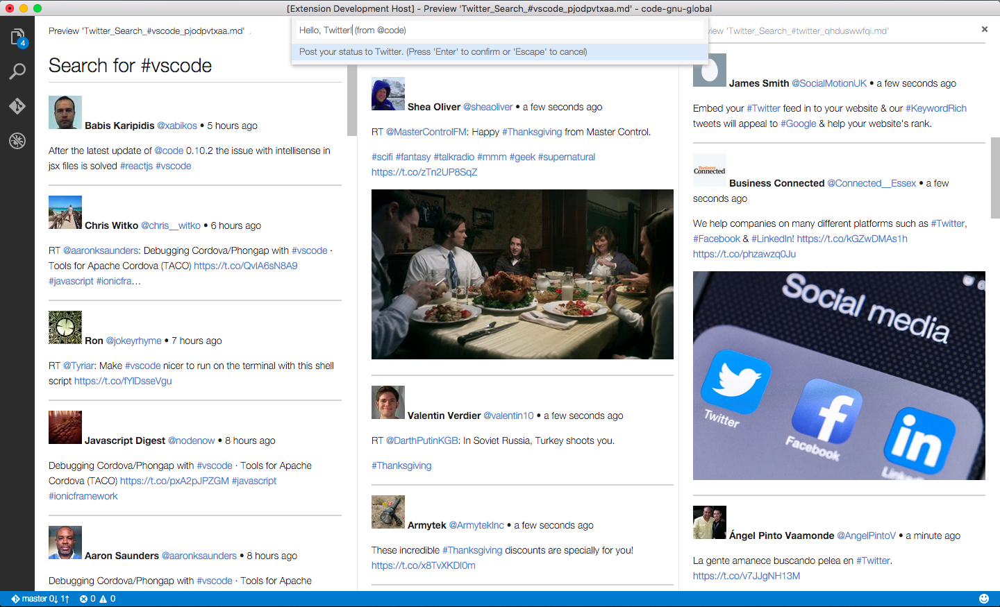

# README

VS Code Twitter

Please go to [https://github.com/austin-----/vscode-twitter](https://github.com/austin-----/vscode-twitter) for source code, bug tracking, and feature request

## Functionality
Now you can look at your Twitter timeline in your favorite editor.

Picture: Up to 3 columns of timelines in action:

## Installation
1. Install 'Twitter' in VS Code

   You can also run command 'Twi Wizard' to guide you through Step 2 ~ Step 5.

2. Register a twitter app with your twitter developer account
3. Give the app 'Read and Write' permission and access to your account
4. Write down the following keys and tokens:

 Consumer Key (API Key)
 
 Consumer Secret (API Secret)
 
 Access Token
 
 Access Token Secret

5. Edit 'User Settings' and add the following parameters:

>    "twitter.consumerkey": "xxxx", // Consumer Key (API Key) 

>    "twitter.consumersecret": "xxxx", // Consumer Secret (API Secret)

>    "twitter.accesstokenkey": "xxxx", // Access Token

>    "twitter.accesstokensecret": "xxxx" // Access Token Secret
    

## Usage
A status bar item is added to launch timelines:

You can use the following commands:

* **Twitter: Display Timeline**: Check your home timeline

* **Twitter: Search**: Search Twitter

* **Twitter: Select Timeline**: Select from home_timeline user_timeline, or mentions_timeline; or perform other actions.

* **Twitter: Post Status**: to post a new tweet.

* **Twitter: Trends**: Look at Twitter trends

## For more information
* [Repo](https://github.com/austin-----/vscode-twitter)
* [VS Code Marketplace](https://marketplace.visualstudio.com/items/austin.a-vscode-twitter)

**Enjoy!**
